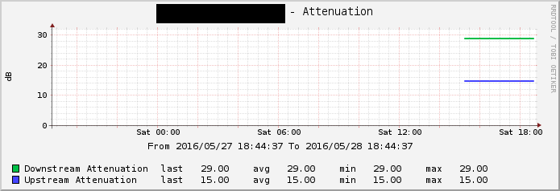

# Monitoring Fritzbox

## Data Monitoring
* Traffic
* Signal Power
* Attenuation
* Noise Margin
* Max possible Datarate
* Max usable Datarate
* CRC Errors

**Traffic**

**Attenuation**

**possible data rates**

**signal power**

**CRC Errors**

## Installation

1. enable "Application Access allowed" in  Network -> Overview -> Networksettings

2. copy fritzbox.py to /usr/share/cacti/site/scripts/

3.1. apt-get install python-pip
3.2. pip install request
3.3. pip install lxml
3.4. # if lxml failes, try   "apt-get install python-lxml"
3.5. pip install fritzconnection

4. import XML Templates in Cacti

## Usage

add your Fritzbox to Devices and add Fritzbox Graph Templates to it
Now, include the Logingpassword on to the request, so API can get accessed from Cacti

