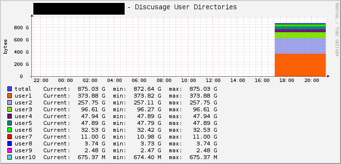

# Top 10 Discusage of Homedirectories

## Installation

The Shell-Script has to be on every relevant machine, for Monitoring User Disc Usages.
The XML has to be imported into Cacti via "Import Templates"
snmpd.conf has to be Extended with this lines:

    extend discusage_total /bin/bash /etc/snmp/cacti_userspaces.sh total
    extend discusage_user1 /bin/bash /etc/snmp/cacti_userspaces.sh user1
    extend discusage_user2 /bin/bash /etc/snmp/cacti_userspaces.sh user2
    extend discusage_user3 /bin/bash /etc/snmp/cacti_userspaces.sh user3
    extend discusage_user4 /bin/bash /etc/snmp/cacti_userspaces.sh user4
    extend discusage_user5 /bin/bash /etc/snmp/cacti_userspaces.sh user5
    extend discusage_user6 /bin/bash /etc/snmp/cacti_userspaces.sh user6
    extend discusage_user7 /bin/bash /etc/snmp/cacti_userspaces.sh user7
    extend discusage_user8 /bin/bash /etc/snmp/cacti_userspaces.sh user8
    extend discusage_user9 /bin/bash /etc/snmp/cacti_userspaces.sh user9
    extend discusage_user10 /bin/bash /etc/snmp/cacti_userspaces.sh user10

**Screenshot**

## Todo
- find a way to get the count of list in cacti dynamically
- find a method to set the user names in legend

