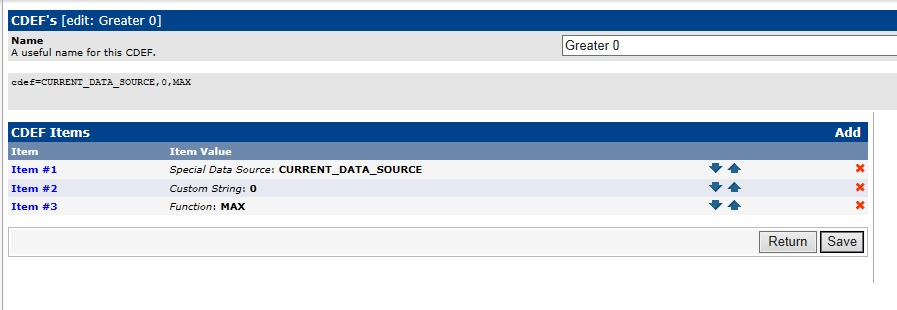

# Weather Condition per location

In directory screenshots you'll find some Screenshots

This Cacti Addon is for getting:
- Temperature Data
- Humidity
- Wind Speed
- Air Pressure
from Openweather graphed in Cacti

## Installation

You need to have Python Modul 'simplejson' installed

1. run
    apt-get install python-pip
    pip install simplejson
3. now copy openweathermap_data.py to the scripts-Directory
(On Debian Systems it's in  "/usr/share/cacti/site/scripts/" )
4. import the XML Templates in Cacti
5. The last point is an optical Feature, with CDEF-Functions for Temperature Graph

    You have to create 2 easy CDEF Functions,
    (maybe there will be an export Function for CDEF in future versions of Cacti too):
    
    

    go to "Graph Management" -> CDEFs
    click on "Add"
    
    
    
    give the name "Greater 0" and click on Create
    now click on Add
     now do this:
        Type: Special Data Source
        Value:  CURRENT_DATA_SOURCE
        (Create)
        Type: Custom String
        Value: 0
        (Create)
        Type: Function
        Value: MAX
     now click on Save

    NOW
    click on "Graph Management" -> CDEFs again
    (yes again, its for creating the second one)
    click on "Add"

    give the name "Lower 0" and click on Create
    now click on Add
     now do this:
        Type: Special Data Source
        Value:  CURRENT_DATA_SOURCE
        (Create)
        Type: Custom String
        Value: 0
        (Create)
        Type: Function
        Value: MIN
     now click on Save

    DONE

    Graph Template should look like this:
    

6. Openweather Map added a free Registration for the Usage of the API.
How to get an API Key, you will find Information in the Script
The API Key has to be added in the Script also

## Usage
Select in Devices an Host click on "Create Graphs for this Host",
select in the Section "Graph Templates" (formally the first one) from the Selection Box "open Weather Map - <the Datatype you want to monitor>"
and click CREATE on the bottom of this Page,
you will be asked for City and Country to get the Temperatures.
(Maybe London uk, or Berlin de, or Paris fr ?)

Tip:
In the first minutes the Title in Graph Template seems to be incomplete.
I found out, if you've got some values in the Graph,
select the Open Weather Map - Graph Template in Graph Templates,
click on save,
now there should be the City and Country listed in the Graph like expected.

## Results
**Humidity**

**Pressure**

**Temperature**

**Windspeed**

